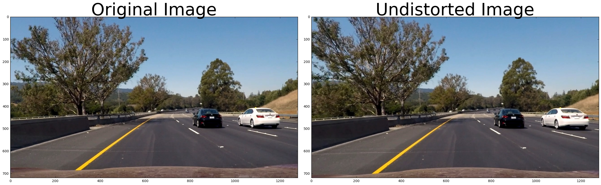
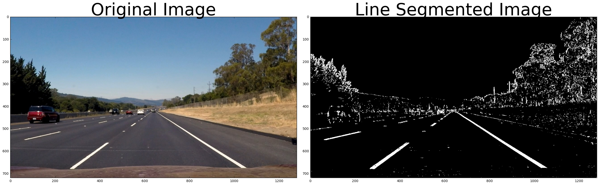
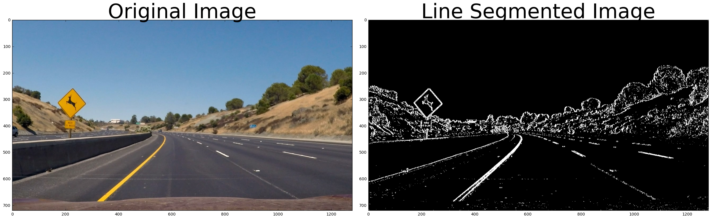
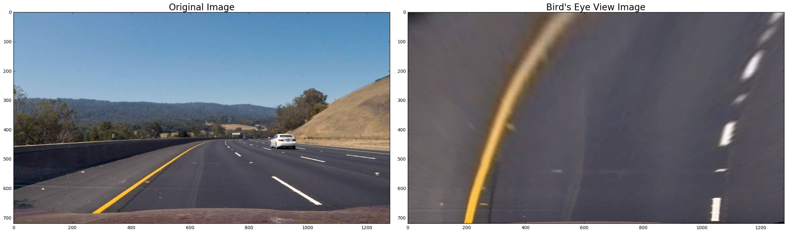
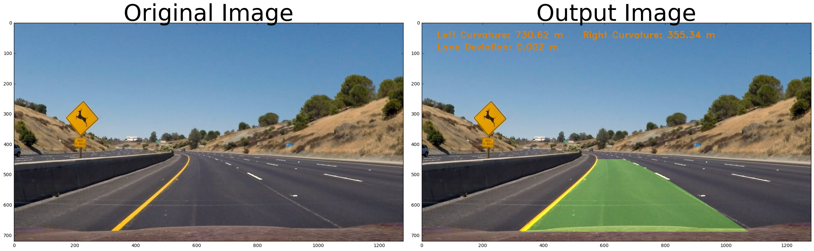

# Advanced Lane Finding
#### By Asim Imdad Wagan

## Introduction
The objective of the fourth project in the udacity's self driving car nanodegree is to create an algorithm which processes the road images for detection of the driving lane.

This readme file will document the algorithm which was developed by me for Advanced Lane Detection project of the udacity SDC.

## Rubric point 1
#### Critera 1:

Provide a Writeup / README that includes all the rubric points and how you addressed each one. You can submit your writeup as markdown or pdf. Here is a template writeup for this project you can use as a guide and a starting point.

##### Specs :
The writeup / README should include a statement and supporting figures / images that explain how each rubric item was addressed, and specifically where in the code each step was handled.

#### Answer

You are reading the document. The output produced
Image | Video
------------|---------------
 | 

## Rubric point 2

#### Critera 2:

Briefly state how you computed the camera matrix and distortion coefficients. Provide an example of a distortion corrected calibration image.

##### Specs :
OpenCV functions or other methods were used to calculate the correct camera matrix and distortion coefficients using the calibration chessboard images provided in the repository (note these are 9x6 chessboard images, unlike the 8x6 images used in the lesson). The distortion matrix should be used to un-distort one of the calibration images provided as a demonstration that the calibration is correct. Example of undistorted calibration image is Included in the writeup (or saved to a folder).

#### Answer

Camera Calibration is performed using the following algorithm. 

1. We first initialise the arrays to store object points and image points from all the calibration images.

        objpoints = [] # 3d points in real world space
        imgpoints = [] # 2d points in image plane.

2. We make a list of calibration images which are located in the camera_cal folder.

        images = glob.glob('./camera_cal/calibration*.jpg')

3. We read all the images and convert them from RGB to gray scale images.

        for fname in images:
            img = cv2.imread(fname)
            gray = cv2.cvtColor(img,cv2.COLOR_BGR2GRAY)

4. We use the opencv's findchessboardCorners function. As the images contain 9x6 corners we pass this as parameter to the function.

            ret, corners = cv2.findChessboardCorners(gray, (9,6),None)

 
5. We use the calibrateCamera function in opencv to get calibration data

        ret, mtx, dist, rvecs, tvecs = cv2.calibrateCamera(objpoints, imgpoints, img.shape[0:2],None,None)

6. We then call the opencv's undistort function to remove distortion from the images

            undist = cv2.undistort(img, mtx, dist, None, None)

##### Results
The results are shown below:

## Rubric point 3

#### Critera 3:

Provide an example of a distortion-corrected image.

##### Specs :
Distortion correction that was calculated via camera calibration has been correctly applied to each image. An example of a distortion corrected image should be included in the writeup (or saved to a folder) and submitted with the project.

#### Answer

The distortion corrected image is shown below. Another shown example is shown above.

## Rubric point 4

#### Critera 4:

Describe how (and identify where in your code) you used color transforms, gradients or other methods to create a thresholded binary image. Provide an example of a binary image result.

##### Specs :
A method or combination of methods (i.e., color transforms, gradients) has been used to create a binary image containing likely lane pixels. There is no "ground truth" here, just visual verification that the pixels identified as part of the lane lines are, in fact, part of the lines. Example binary images should be included in the writeup (or saved to a folder) and submitted with the project.

#### Answer
The techniques are built into the pipeline function which is present in alanedetector.py's CLaneDetector class.

1. Red Channel is extracted from the image and white lines are extracted through it because red Channel is more sensitive to white lines.

        r_channel = img[:, :, 0]
        r_thresh = (200, 255)
        r_binary = np.zeros_like(r_channel)
        r_binary[(r_channel >= r_thresh[0]) & (r_channel <= r_thresh[1])] = 1

2. S and V channels are extracted from the HSV converted images. 

        hsv = cv2.cvtColor(img, cv2.COLOR_RGB2HSV)
        s_channel = hsv[:, :, 1]
        v_channel = hsv[:, :, 2]

3. Scharr transform is performed to calculate the gradient rather then sobel as scharr is a more robust form of sobel operator.

        scharrx = cv2.Scharr(v_channel, cv2.CV_64F, 1, 0)
        abs_scharrx = np.absolute(scharrx)
        scaled_scharr = np.uint8(255 * abs_scharrx / np.max(abs_scharrx))
        thresh_min = 10
        thresh_max = 255
        scharr_x_binary = np.zeros_like(scaled_scharr)
        scharr_x_binary[(scaled_scharr >= thresh_min) & (scaled_scharr <= thresh_max)] = 1

4. S and V channel are threhsolded with suitable thresholds for detecting traces of the lines.

        s_binary = np.zeros_like(s_channel)
        s_thresh_min = 100
        s_thresh_max = 255
        s_binary[(s_channel >= s_thresh_min) & (s_channel <= s_thresh_max)] = 1
        v_binary = np.zeros_like(v_channel)
        v_thresh_min = 200
        v_thresh_max = 255
        v_binary[(v_channel >= v_thresh_min) & (v_channel <= v_thresh_max)] = 1

5. A combined binary image is created with highlighted lanes.

        binary = np.zeros_like(scharr_x_binary)
        binary[((v_binary == 1) & (s_binary == 1) | (r_binary == 1)  | (scharr_x_binary == 1))] = 255
        

These three operations are 

## Rubric point 5

#### Critera 5:

Describe how (and identify where in your code) you performed a perspective transform and provide an example of a transformed image.

##### Specs :
OpenCV function or other method has been used to correctly rectify each image to a "birds-eye view". Transformed images should be included in the writeup (or saved to a folder) and submitted with the project.

#### Answer
The presepective transform is performed on the images to convert them into birds-eye view images.

|Source Points | Destination Points|
|--------------|-------------------|
|(590, 450)    |   (200, 0)        |
|(690, 450)    |   (1000, 0)       |
|(270, 690)    |   (200, 720)      |
|(1050, 690)   |   (1000, 720)     |

The resultant images are shown below:

## Rubric point 6

#### Critera 6:

Describe how (and identify where in your code) you identified lane-line pixels and fit their positions with a polynomial?

##### Specs :
Methods have been used to identify lane line pixels in the rectified binary image. The left and right line have been identified and fit with a curved functional form (e.g., spine or polynomial). Example images with line pixels identified and a fit overplotted should be included in the writeup (or saved to a folder) and submitted with the project.

#### Answer

The lane detection is performed in the CLaneDetector class's line_detection function. The function takes following steps to detect the lines.

1. We take a histogram of the bottom half of the image
2. We detect the line peaks of the left and right halves of the histogram. These will be the starting point for the left and right lines
3. Sliding windows are run through bottom to top on both sides of the image.
4. We detect the x and y positions of all nonzero pixels in the image
5. Positions to be updated for each window whichL
6. All left and right line pixel positions are used to fit a second order polynomial using the polyfit function.

The resultant fit is shown in the image below:

## Rubric point 7

#### Critera 7:

Describe how (and identify where in your code) you calculated the radius of curvature of the lane and the position of the vehicle with respect to center.

##### Specs :
Here the idea is to take the measurements of where the lane lines are and estimate how much the road is curving and where the vehicle is located with respect to the center of the lane. The radius of curvature may be given in meters assuming the curve of the road follows a circle. For the position of the vehicle, you may assume the camera is mounted at the center of the car and the deviation of the midpoint of the lane from the center of the image is the offset you're looking for. As with the polynomial fitting, convert from pixels to meters.

#### Answer
The curvature is detected in the **``calculate_road_info(self, image_size, left_x, right_x)``** function which calculates the curvature and lane deviation information as described in the udacity lectures. The function takes the image size and left and right lanes x values and using that it returns the curvature and deviation information.

## Rubric point 8

#### Critera 8:

Provide an example image of your result plotted back down onto the road such that the lane area is identified clearly.

##### Specs :
The fit from the rectified image has been warped back onto the original image and plotted to identify the lane boundaries. This should demonstrate that the lane boundaries were correctly identified. An example image with lanes, curvature, and position from center should be included in the writeup (or saved to a folder) and submitted with the project.

#### Answer
The examples outputs are shown below:

## Rubric point 9

#### Critera 9:

Provide a link to  your final video output. Your pipeline should perform reasonably well on the entire project video (wobbly lines are ok but no catastrophic failures that would cause the car to drive off the road!)

##### Specs :
The image processing pipeline that was established to find the lane lines in images successfully processes the video. The output here should be a new video where the lanes are identified in every frame, and outputs are generated regarding the radius of curvature of the lane and vehicle position within the lane. The pipeline should correctly map out curved lines and not fail when shadows or pavement color changes are present. The output video should be linked to in the writeup and/or saved and submitted with the project.

#### Answer
Final video output is provided in the output.mp4 file while the compressed gif is shown below:

## Rubric point 10

#### Critera 10:

Briefly discuss any problems / issues you faced in your implementation of this project. Where will your pipeline likely fail? What could you do to make it more robust?

##### Specs :
Discussion includes some consideration of problems/issues faced, what could be improved about their algorithm/pipeline, and what hypothetical cases would cause their pipeline to fail.

#### Answer
This project was comparatively similar to the first project but it required more reigourous work. It was more robust under different road conditions but it also raised the bar of complxity of this project. I am excited to work on it. I find the segmentation part particularly very challenging but due to restrictions put on us to use the gradient and color thresholding to solve this problem, I was unable to use more complex methods. I would have liked to implmented a classifier over it with training data for lane markers and non-lane areas. This could have given us more powerful results rather then relying on a fixed set of rules and regulations.
A more thourough study of this area is required and I will focus on a comprehensive solution in future.

